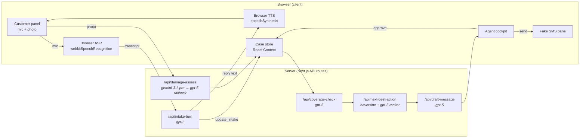

# RoadAssist Co-Pilot — Prototype Plan

A single-page Next.js prototype of RoadAssist Co-Pilot: two-panel layout with customer + fake SMS on the left and the agent cockpit on the right. Voice uses the browser's Web Speech API for ASR/TTS plus a turn-based `gpt-5` agent; damage assessment uses Gemini 3.1 Pro vision with GPT-5 as cross-provider fallback; coverage, dispatch, and message drafting are prompt-only LLM calls with strict JSON schemas. No fine-tuned models, no real telephony, no DB.

## 1. Goal & guiding principles

Demonstrate the end-to-end target flow from the [Challenge.md](Challenge.md) in one screen, using the pragmatic shortcuts agreed with the user:

- **All AI is prompt-driven, no fine-tuning, no specialized models.** For the demo we pick the **best-available frontier model per task, cost ignored**:
  - **Vision (damage):** primary **Gemini 3.1 Pro** (~82% MMMU-Pro, leading vision benchmarks April 2026), fallback **GPT-5** for cross-provider robustness on demo day.
  - **Text (intake voice agent, coverage, dispatch ranker, message draft):** **GPT-5** for top-tier reasoning + reliable structured outputs.
- The split also demonstrates the provider-agnostic adapter pattern from [PRD.md](PRD.md) §6 — both providers sit behind a thin `lib/llm/{openai,gemini}.ts` interface so any model can be swapped via env config.
- **Voice is browser-native, not Realtime API.** ASR via `webkitSpeechRecognition`, TTS via `speechSynthesis`, and a turn-based `gpt-5` agent in between. Honest trade-off documented below; ~10x less code than Realtime + WebRTC.
- **SMS is faked** in a pane pinned to the bottom of the customer column.
- **UX is simple, not pretty** — one screen, two panels, obvious affordances, focus on flow, not visuals.
- **Human-in-the-loop is mandatory** for the demo (matches the M1 gate in [PRD.md](PRD.md)): nothing dispatches and no SMS sends without an explicit click.

## 2. End-to-end flow

## 3. UX — two panels

`app/page.tsx` lays out a 2-column grid (roughly 40% / 60%):

- **Left column — customer experience** (`components/CustomerPanel.tsx`):
  - Top: customer selector (1 of 2–3 synthetic profiles) with a small read-only **"You are playing: {name}, {vehicle}, {policy}"** caption underneath so the demo-er knows the role. Picking a customer **immediately pre-populates the cockpit intake card** with `name`, `vehicle`, and `policy` (mimicking real-world caller-ID + CRM lookup) and seeds a default `location` from the customer profile. The voice agent then only needs to collect the runtime fields: situation, damage description, and any location refinement.
  - "Start call" mic button, live transcript with ASR partials, agent's last spoken reply, photo upload zone with 2–3 preset sample images.
  - Bottom (~25% of column height, pinned): fake SMS pane (`components/FakeSmsPane.tsx`) with iMessage-style bubbles, timestamps, populated when the agent clicks "Send" in the cockpit.
- **Right column — agent cockpit** (`components/CockpitPanel.tsx`):
  - Live extracted intake card (name, vehicle, location, situation, damage description) with inline edit.
  - Damage assessment card: type, severity 1–5, drivability, confidence, evidence quote.
  - Coverage decision card: covered / not covered, cited clause (verbatim quote + section ref), deductible, confidence, reason.
  - Next-best-action card: dispatch type (tow / mobile repair / taxi / rental), provider, distance (mi) + ETA (min), "Approve dispatch" button.
  - Customer message card: AI draft, editable textarea, "Send SMS" button (writes to the fake SMS pane on the left).
  - Audit log: chronological list of events (extraction, AI decision, agent edit, approval, send).

Mandatory-approval is enforced in the UI: the dispatch button and the SMS button are the only paths that mutate the case to `dispatched` / `notified`.

## 4. Tech stack

- **Next.js 15 (App Router) + TypeScript**, single deployment, server routes for all LLM calls so API keys never reach the browser.
- **Tailwind + shadcn/ui** for fast, clean panels.
- **React Context + `useReducer`** for the in-memory case store — no extra dependency. The reducer pattern doubles as the audit-log source: every dispatched action (`INTAKE_UPDATED`, `DAMAGE_ASSESSED`, `COVERAGE_DECIDED`, `DISPATCH_APPROVED`, `SMS_SENT`, etc.) is also appended to the audit log, so we get the "full audit log per case" requirement from [PRD.md](PRD.md) §2 F6 essentially for free. No DB.
- **Zod** for JSON-schema validation of every AI output.
- **OpenAI SDK** server-side for `gpt-5` text routes + the vision fallback. **Google `@google/genai` SDK** for the primary `gemini-3.1-pro` vision call. Both wrapped behind a tiny `lib/llm/` adapter. No Realtime, no WebRTC.
- **Required env vars:** `OPENAI_API_KEY` + `GOOGLE_GENERATIVE_AI_API_KEY`. Optional `LLM_*_MODEL` overrides so the model can be swapped without a code change on demo day. README documents both.
- **Browser Web Speech API** (`webkitSpeechRecognition` + `speechSynthesis`) for voice I/O. Chrome/Edge primary; trade-off documented in the README.

## 5. AI touchpoints (prompt-only)

All routes live under `app/api/*/route.ts`. Each one validates with Zod and routes failures to "needs human review" in the cockpit.

- **AI-1 voice intake — browser-native, turn-based.** No server-side voice models.
  - **Pre-populated context:** when a customer is selected from the dropdown, the cockpit intake card is seeded with their identity (`name`, `vehicle`, `policyId`, default `location`). `/api/intake-turn` receives this seeded intake on every call so the voice agent never re-asks for known information; its system prompt instructs it to **acknowledge the caller by name** and jump straight to the runtime questions (situation, location refinement, damage description).
  - **ASR:** `webkitSpeechRecognition` (or `SpeechRecognition`) with `interimResults` and `continuous`. Final transcript per turn is sent to the server.
  - **Brain:** `POST /api/intake-turn` accepts `{conversationHistory, lastUserUtterance, currentIntake}`, calls **`gpt-5`** with the system prompt (empathetic roadside assistant, one question at a time, escalate on injury keywords) and two tools: `update_intake({field, value})` for partial extractions and `complete_intake()` to mark intake done. Returns `{replyText, toolCalls}`.
  - **TTS:** `speechSynthesis.speak(new SpeechSynthesisUtterance(replyText))`. We pick the best available `en-US` voice from `getVoices()` at boot.
  - **Trade-off vs. Realtime:** turn-based feel (~1s gap), no streaming, no barge-in, OS-dependent voice quality, Chrome/Edge required. The `/api/intake-turn` boundary is the swap-in point for OpenAI Realtime later — same intake schema and tools.
- **AI-2 damage assessment (pragmatic substitute).** `POST /api/damage-assess` takes the uploaded image (as inline base64 part) + a transcript snippet.
  - **Primary:** **`gemini-3.1-pro`** via `@google/genai`, with `responseMimeType: "application/json"` + `responseSchema` matching `{type, severity (1-5), drivability, confidence, evidence_quote, recommended_action}`.
  - **Fallback chain:** Gemini retry once on schema-validation failure or 5xx → if still failing, **fail over to `gpt-5` vision** (different provider, same Zod schema) → if both fail, escalate to "needs human review" in the cockpit. The cross-provider failover is the explicit hedge against any single provider having a bad day during the live demo.
  - **Demo-day pre-warm:** on `app/page.tsx` mount, fire a tiny health-check ping to both providers so cold-start latency doesn't surprise us.
  - This is the explicit deviation from [PRD.md](PRD.md) §6 AI-2 (no fine-tuned VLM); the prompt + strict JSON schema do the job for the prototype.
- **AI-3/4 policy retrieval + coverage adjudication.** The customer-supplied `policies.json` is the source of truth. `POST /api/coverage-check` accepts `{intake, damageAssessment, policyId}`, looks up the matching policy object, and passes `{intake, damage, policy}` to **`gpt-5`** with a strict JSON schema response: `{covered, deductible, clauseQuote, clauseRef, confidence, reason}`. Server-side guard: `clauseQuote` must be a substring of the concatenated clause text in the policy JSON, or the response is rejected and retried once, then escalated to "needs human review."
- **AI-5 next-best-action.**
  - **Inputs needed:** customer location (lat/long from the customer profile or geocoded landmark), vehicle make/model (from intake), damage drivability + severity (from AI-2), policy entitlements (e.g., does coverage include a rental?), and the provider list.
  - **Distance & ETA (prototype):** **haversine** great-circle distance between customer and each provider's lat/long (~10 lines of TS, zero deps). Computed and displayed in **miles** for the US demo audience. Because haversine is straight-line, we apply two corrections to keep the ETA honest: a **circuity factor of 1.3** (real roads detour ~20–40% over the straight line) and an **average speed of 20 mph** (NYC tri-state mixed surface streets + bridges + freeway with traffic + stops). Final formula: `eta_min = (distance_mi * 1.3) / 20 * 60`. Both constants are documented in `lib/geo/haversine.ts` and disappear when we swap to OSRM / Google Distance Matrix in production (called out in the README).
  - **Pipeline:** `POST /api/next-best-action` runs a deterministic filter (capability matches damage need, provider open-now, brand serviced, within max-radius), computes haversine distance/ETA, then asks **`gpt-5`** to rank the top 3 candidates and pick a dispatch type (`tow` / `mobile-repair` / `taxi` / `rental`) with a one-line rationale. The rule engine remains the safety-critical layer.
- **AI-6 customer message draft.** `POST /api/draft-message` drafts the SMS with **`gpt-5`** under a carrier tone-of-voice snippet, given the coverage decision and the chosen provider/ETA; the agent always edits + clicks Send.

Schemas, prompts, distance helper, and the policy-clause validator live in `lib/schemas/`, `lib/prompts/`, `lib/geo/`, `lib/coverage/`.

## 6. Synthetic data

- **`data/policies.json`** — provided by the user. We'll inspect its shape on first use; expected fields per policy: `id`, `name`, `clauses[]` (each with `id`/`ref`, `title`, `text`, `appliesTo` tags such as `mechanical-breakdown` / `flat-tire` / `accident-without-injury`), `entitlements` (towing limit mi, rental days, deductible). If the actual schema differs we adapt the prompt and the substring guard accordingly.
- **`data/customers.json`** — 2–3 customer profiles set in the **NYC tri-state area** (interviewer-relatable geography). Each has `id`, `name`, `vehicle {make, model, year}`, `policyId`, default `location {lat, lng, label}` — e.g. Maria broken down on I-95 (Cross Bronx Expressway) just east of the George Washington Bridge (~40.847, -73.928).
- **`data/providers.json`** — ~6 providers spread across the tri-state (Upper Manhattan, Bronx / Hunts Point, Queens / LIC, Brooklyn / Williamsburg, Fort Lee NJ, Yonkers), each with `id`, `name`, `location {lat, lng}`, `capabilities[]` (`tow` / `repair` / `taxi` / `rental`), `hours`, optional `brandWhitelist[]`. Lat/long picked so the filter has plausible 2–15 mi candidates and ETAs land in the 10–35 min range.
- **`public/sample-damage/*.jpg`** — 2–3 royalty-free damage photos so the demo doesn't depend on the camera. Sourced from the existing `datasets/car-damage-images` folder if populated; otherwise fetched from a CC-licensed source.

## 7. File layout

- `app/page.tsx`, `app/layout.tsx`
- `app/api/intake-turn/route.ts`
- `app/api/damage-assess/route.ts`
- `app/api/coverage-check/route.ts`
- `app/api/next-best-action/route.ts`
- `app/api/draft-message/route.ts`
- `components/CustomerPanel.tsx`, `components/CockpitPanel.tsx`, `components/FakeSmsPane.tsx`
- `components/cards/*` (intake, damage, coverage, dispatch, message, audit)
- `lib/case/{context.tsx,reducer.ts,actions.ts,types.ts}` (React Context + reducer for the case store)
- `lib/voice.ts` (ASR + TTS hooks)
- `lib/llm/openai.ts`, `lib/llm/gemini.ts`
- `lib/prompts/{intake,damage,coverage,nba,message}.ts`
- `lib/schemas/{intake,damage,coverage,nba,message}.ts`
- `lib/coverage/validateClause.ts`, `lib/geo/haversine.ts`
- `data/policies.json`, `data/customers.json`, `data/providers.json`
- `public/sample-damage/*.jpg`
- `README.md` with setup, env vars, demo script, browser requirement (Chrome/Edge)

## 8. Time budget (fits ~5h core + buffer)

- 30 min — scaffold Next.js, Tailwind, shadcn, 2-panel layout, store, env wiring.
- 30 min — synthetic data: load + validate `policies.json`, author `customers.json` + `providers.json`, drop sample images.
- 40 min — voice intake: `useSpeechRecognition` + `useSpeechSynthesis` hooks, `/api/intake-turn` route, system prompt, `update_intake` / `complete_intake` tool calls feeding the store.
- 30 min — `damage-assess` route + cockpit damage card.
- 40 min — `coverage-check` route with clause-substring guard + cockpit coverage card.
- 30 min — `next-best-action` (haversine + filter + ranker) + `draft-message` + corresponding cards.
- 30 min — fake SMS pane (pinned bottom-left) + audit log + Approve / Send wiring.
- 30 min — end-to-end test of the demo script, README, polish.

## 9. Demo script (for the pitch)

1. Pick "Maria — Policy Gold" from the customer dropdown. The cockpit intake card immediately fills in **Name: Maria Chen**, **Vehicle: 2022 Toyota Camry**, **Policy: Gold**, **Location: I-95 / Cross Bronx near the GWB (default)**, with the runtime fields (situation, damage) still empty.
2. Click **Start call**. The voice agent greets: *"Hi Maria — I see you're driving the 2022 Camry. What's happening with the car?"* Reply: *"It broke down on the Cross Bronx near the GWB, engine died, I can't restart it."*
3. Watch the runtime intake fields populate in the cockpit as the voice agent acknowledges each one through the laptop speakers.
4. Upload `public/sample-damage/engine-bay.jpg`.
5. Damage card fills in: mechanical / severity 3 / not drivable / "smoke from engine bay".
6. Coverage card shows **Covered**, cites *"Mechanical breakdown — clause 4.2"* with the verbatim clause text from `policies.json`, deductible $0.
7. Dispatch card recommends **Tow + Rental**, picks **Fort Lee Auto Care** (closest provider via haversine, just across the GWB), distance 1.6 mi straight-line → 2.1 mi road-adjusted → ETA ~6 min, or **Hunts Point Towing** as the next option at ~14 min.
8. Agent reviews the AI-drafted SMS, tweaks one word, clicks **Send** — the message lands in the fake SMS pane at the bottom of the customer column with a timestamp.
9. Audit log shows the full chain. Total: ~30 seconds of agent work.

## 10. Explicitly out of scope (call out in PRD / README)

- Real fine-tuned damage VLM (AI-2 in [PRD.md](PRD.md) §6) — replaced by frontier vision LLMs (`gemini-3.1-pro` primary, `gpt-5` vision fallback) with a strict JSON schema.
- Real telephony / SMS — both faked in-browser.
- OpenAI Realtime / streaming voice — replaced by browser Web Speech + turn-based LLM.
- Multi-language (F8), fraud detection (F9), white-label portal (F11) — v1.5 / v2 in the PRD.
- Auth, multi-tenancy, persistence, real provider APIs, real geocoding/routing (we use haversine + average speed).
- Embeddings / vector retrieval — single matching policy is passed inline.

## 11. Risks during the build

- **Web Speech API browser quirks** — must run on Chrome or Edge; Safari/Firefox not supported in the demo. README calls this out. Mic permission must be granted; we surface a clear error in the customer panel if it isn't.
- **TTS voice quality** — varies by OS; we pick the best `en-US` voice at boot and let the user override via a small dropdown if needed.
- **Single-provider outage on demo day** — vision call has a Gemini → GPT-5 cross-provider failover; both health-checked on app boot. Text routes are GPT-5 only by default, but `LLM_TEXT_MODEL` can be flipped to `gemini-3.1-pro` from `.env` without redeploying if OpenAI is down.
- **Vision JSON drift** — strict Zod schema + one retry with the validator error fed back into the prompt; on second failure, fail over to the other provider; on third, surface "needs human review" in the cockpit.
- **Clause-citation hallucination** — substring guard against the policy clause text; reject + retry, then escalate. Mirrors the guardrail in [PRD.md](PRD.md) §6.
- **Policy JSON shape mismatch** — first action is to read the file and adapt schemas + prompts; if the file is significantly different we'll surface the deviation before continuing.
- **Time overrun** — if anything slips, drop AI-5 LLM ranking (keep deterministic filter + nearest haversine only) and AI-6 (use a single hand-written template). Both are independent.
